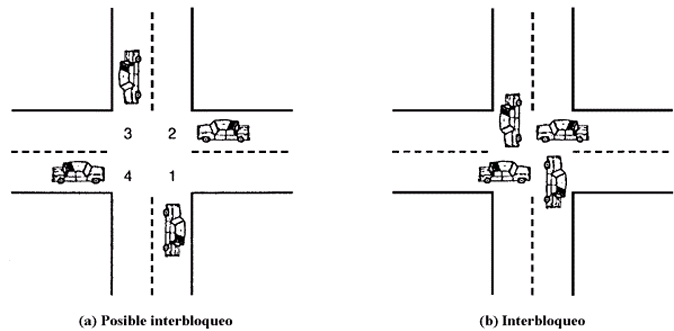

# Punto 3

En la siguiente imagen, extraída de un cruce de calles, cada auto desea seguir su ruta (a), y de no tener algún mecanismo de orden o control se producirá un choque, traducido, un interbloqueo (b).

Los cuatro cuadrantes de la intersección son los recursos compartidos sobre los que se demanda control, si los cuatro coches desean atravesar el cruce, las necesidades de recursos son las siguientes:

- El coche que va hacia el norte necesita los cuadrantes 1 y 2  
- El coche que va hacia el oeste necesita los cuadrantes 2 y 3  
- El coche que va hacia el sur necesita los cuadrantes 3 y 4  
- El coche que va hacia el este necesita los cuadrantes 4 y 1  

Implemente mediante pseudocódigo una rutina que permita la circulación de los autos y evite el interbloqueo, para ello debe emplear semáforos como mecanismo de sincronización, y debe identificar cada auto por el sentido hacia donde desea ir (N, S, E y O).
